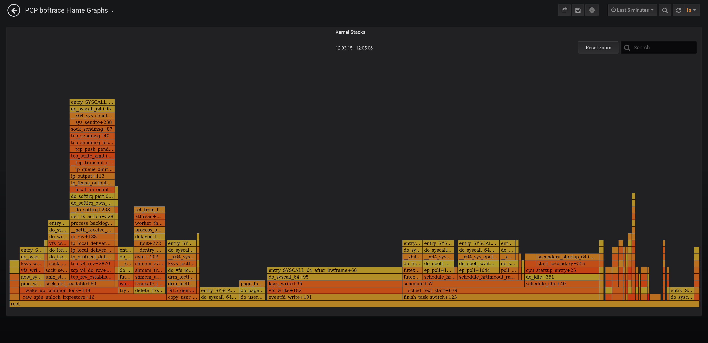

# Performance Co-Pilot Grafana Plugin

[](https://dev.azure.com/performancecopilot/grafana-pcp/_build/latest?definitionId=4&branchName=master)

[Performance Co-Pilot (PCP)](https://pcp.io) provides a framework and services to support system-level performance monitoring and management.
It presents a unifying abstraction for all of the performance data in a system, and many tools for interrogating, retrieving and processing that data.

[](docs/_static/img/vector-overview.png)
[](docs/_static/img/bpftrace-flame-graph.png)
[](docs/_static/img/vector-metric-autocompletion.png)
[](docs/_static/img/bpftrace-probe-autocompletion.png)
[more screenshots](docs/_static/img)

## Features
* analysis of historical PCP metrics using [pmseries](https://www.mankier.com/1/pmseries) query language
* analysis of real-time PCP metrics using [pmwebapi](https://www.mankier.com/3/PMWEBAPI) live services
* enhanced Berkeley Packet Filter (eBPF) tracing using [bpftrace](https://www.mankier.com/8/bpftrace) scripts
* automatic rate conversation for counter metrics
* heatmap and table support
* auto completion of metric names [1,2], qualifier keys and values [1], and bpftrace probes, builtin variables and functions [3]
* display of semantics, units and help texts of metrics [2] and bpftrace builtins [3]
* legend templating support with `$metric`, `$metric0`, `$instance`, `$some_label`, `$some_dashboard_variable`
* container support [1,2]
* support for custom endpoint URL [1,2,3] and container [2] setting per query
* support for repeated panels
* sample dashboards for all data sources

[1] PCP Redis
[2] PCP Vector
[3] PCP bpftrace


# Data Sources

## PCP Redis
This data source queries the fast, scalable time series capabilities provided by the pmseries(1) functionality.
It is intended to query **historical** data across **multiple hosts** and supports filtering based on labels.

## PCP Vector
The PCP Vector data source shows **live, on-host metrics** from the real-time pmwebapi(3) interfaces.
It is intended for individual host, on-demand performance monitoring and includes container support.

## PCP bpftrace
The PCP bpftrace data source supports system introspection using bpftrace(8) scripts.
It connects to the bpftrace PMDA and runs bpftrace scripts on the host.

# Installation
Download a release tarball from https://github.com/performancecopilot/grafana-pcp/releases,
extract it to `/var/lib/grafana/plugins`, restart grafana, enable the Performance Co-Pilot
plugin and setup the data sources.

```
$ wget https://github.com/performancecopilot/grafana-pcp/archive/v1.0.3.tar.gz
$ sudo tar xfz v1.0.3.tar.gz -C /var/lib/grafana/plugins
$ sudo systemctl restart grafana-server 
```

# Build
Clone the git repository at https://github.com/performancecopilot/grafana-pcp and type:

```
yarn install
yarn run build
```
